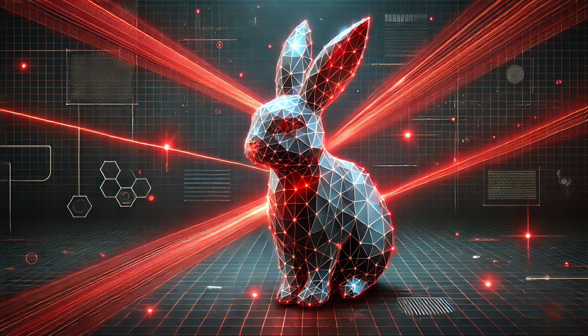
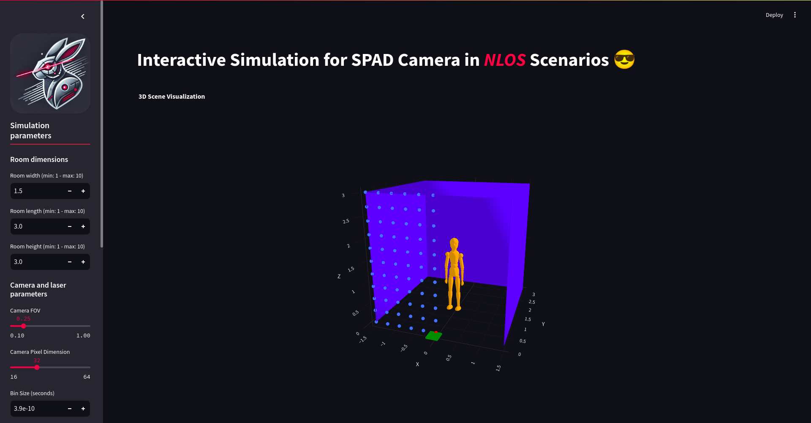
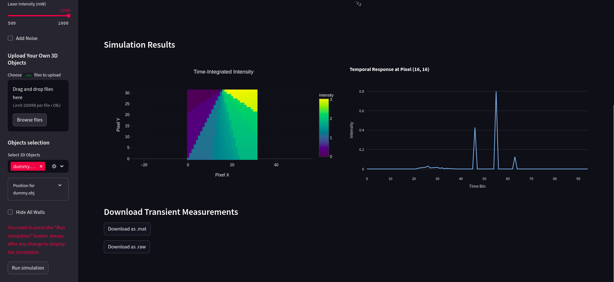

# 📡 SPAD Camera Simulation in NLOS Scenarios
<p align="center">
  
</p>

### Interactive Streamlit App for Simulating Single-Photon Avalanche Diode (SPAD) Cameras in Non-Line-of-Sight (NLOS) Environments 🚀

---

## 📝 Table of Contents

- [Overview](#overview)
- [Features](#features)
- [Installation](#installation)
- [Usage](#usage)
- [Demo](#demo)
- [Dependencies](#dependencies)
- [Contributing](#contributing)

---

## 🌐 Overview

This project provides an interactive **Streamlit-based web app** to simulate SPAD camera behavior in NLOS environments. The app allows users to define room dimensions, add custom 3D objects (uploaded or pre-existing), and configure simulation parameters such as camera FOV, laser intensity, noise, and more. The visualization is powered by **Trimesh** and **Plotly**, providing a dynamic 3D rendering experience.

---

## 🚀 Features

- **Interactive UI**: Streamlit interface for configuring and running simulations.
- **3D Visualization**: Real-time visualization of the room and objects using Plotly.
- **Customizable Parameters**: Adjust room size, camera settings, laser intensity, and noise levels.
- **Object Upload**: Upload `.obj` 3D models to include in the simulation.
- **Noise Simulation**: Add background, sensor, and Poisson noise to the measurements.
- **Downloadable Data**: Export simulation results as `.mat` or `.raw` files.

---

## ⚙️ Installation

1. **Clone the repository**:

   ```bash
   git clone https://github.com/CristianR8/NLOS-Simulator
   cd NLOS-Simulator
   ```

2. **Create a virtual environment** (optional but recommended):

   ```bash
   python -m venv venv
   source venv/bin/activate  # On Windows use `venv\Scripts\activate`
   ```

3. **Install dependencies**:

   ```bash
   pip install -r requirements.txt
   ```
---

## 🖥️ Usage

1. **Run the Streamlit app**:

   ```bash
   streamlit run NLOS_simulator.py
   ```

2. **Open the app** in your browser at [http://localhost:8501](http://localhost:8501).

3. **Configure the simulation** parameters, upload objects if needed, and click "Run Simulation" to visualize results.

---

## 🎥 Demo




---

## 📦 Dependencies

This project relies on the following libraries:

- **Streamlit** for the web interface
- **Trimesh** for 3D mesh handling
- **Plotly** for visualization
- **NumPy** for numerical operations
- **Matplotlib** for plotting

Install all dependencies using:

```bash
pip install -r requirements.txt
```
---

## 🤝 Contributing

Contributions are welcome! To contribute:

1. Fork the repository.
2. Create a new branch: `git checkout -b feature-branch`.
3. Make your changes and commit: `git commit -m "Add new feature"`.
4. Push to the branch: `git push origin feature-branch`.
5. Open a pull request.

---

<p align="center">
  🚀 <b>Happy Simulating!</b> 🚀
</p>

